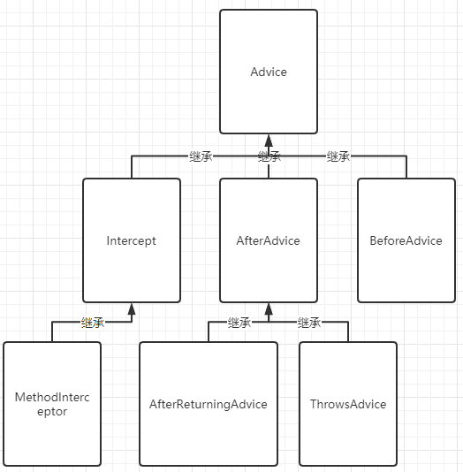
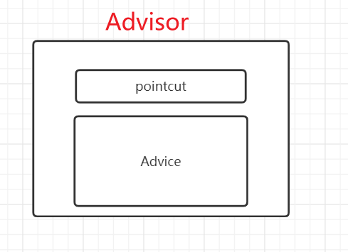
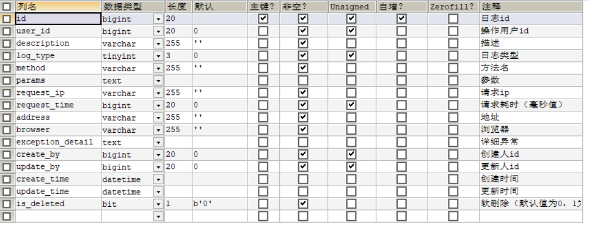
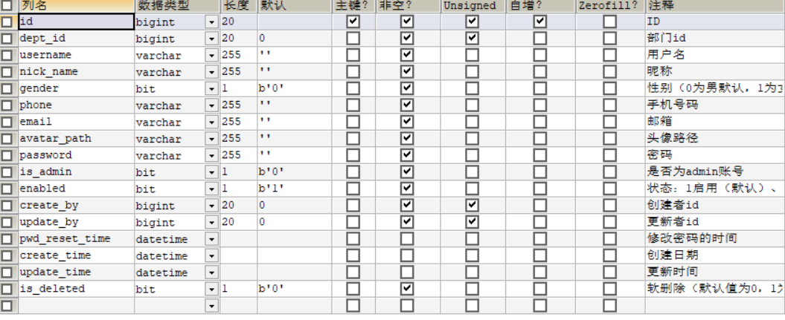

# 日志处理技术方案

## 项目需求

1.  为smpe-admin框架添加日志处理模块
2.  持久化存储日志处理
3.  后台图形化界面管理
4.  具有可扩展性方便后期改造升级

## 技术选型

### Spring框架AOP

​	实现smpe-admin框架的日志处理功能，采用的是Spring框架中的AOP功能。AOP 要达到的效果是，保证开发者不修改源代码的前提下，去为系统中的业务组件添加某种通用功能。
​	按照 AOP 框架修改源代码的时机，可以将其分为两类：

-   静态 AOP 实现， AOP 框架在编译阶段对程序源代码进行修改，生成了静态的 AOP 代理类（生成的 *.class 文件已经被改掉了，需要使用特定的编译器），比如 AspectJ。
-   动态 AOP 实现， AOP 框架在运行阶段对动态生成代理对象（在内存中以 JDK 动态代理，或 CGlib 动态地生成 AOP 代理类），如 SpringAOP。

下面给出常用 AOP 实现比较：


### 为什么选用AOP

​	想象下面的场景，开发中在多个模块间有某段重复的代码，我们通常是怎么处理的？

​	在传统的面向过程编程中，我们也会将这段代码，抽象成一个方法，然后在需要的地方分别调用这个方法，这样当这段代码需要修改时，我们只需要改变这个方法就可以了。然而需求总是变化的，有一天，新增了一个需求，需要再多出做修改，我们需要再抽象出一个方法，然后再在需要的地方分别调用这个方法，又或者我们不需要这个方法了，我们还是得删除掉每一处调用该方法的地方。实际上涉及到多个地方具有相同的修改的问题我们都可以通过 AOP 来解决。

## Aop的基本原理

### 核心元素

#### 1、Pointcut-切入点表达式

​	Spring框架中的org.springframework.aop.Pointcut接口是一个重要接口，能够用于对不同的类以及方法设置不同的通知，即对目标对象的方法通过相同的的切入点设置不同的增强。Spring AOP 所支持的 AspectJ 切点指示器。


​	当我们查看上面展示的这些spring支持的指示器时，注意只有execution指示器是唯一的执行匹配，而其他的指示器都是用于限制匹配的。这说明execution指示器是我们在编写切点定义时最主要使用的指示器，在此基础上，我们使用其他指示器来限制所匹配的切点。

​	多个匹配之间我们可以使用链接符 `&&`、`||`、`！`来表示 “且”、“或”、“非”的关系。

举例：

```java
//限定该切点仅匹配的包是 com.sharpcj.aopdemo.test1,可以使用
execution(* com.sharpcj.aopdemo.test1.IBuy.buy(..)) && within(com.sharpcj.aopdemo.test1.*)
```

#### 2、 Advice-通知

​	Spring框架提供几个常用的Advice，如：Before Advice、Throws Advice、Throws Advice、After Returning Advice等……但是你可以通过实现Advice类型的接口来扩展你想要的Advice。通知与切入点表达式相关联，它与切入点配合用于完成对目标方法的增强，pointcut负责匹配目标对象的目标方法，advice主要负责通知。

Advice继承图：



常用的advice包括5种，分别是

-   BeforeAdvice

    ​	这个类型的Advice会在方法执行之前调用。不能够改变返回值，不能够改变目标方法的流程，也不能中断流程的处理过程（除非抛出异常）

-   AfterAdvice

    ​	在方法调用之后，做处理。可以改变返回值，不能够改变目标方法的流程，也不能中断流程的处理过程（除非抛出异常）

-   AfterReturningAdvice

    ​	在方法调用之后，做处理。不能够改变返回值，不能够改变目标方法的流程，也不能中断流程的处理过程（除非抛出异常）

-   MethodInterceptor

    ​	在方法调用之前以及之后，做处理。可以改变返回值，也可以改变流程。

-   ThrowsAdvice

    ​	在方法抛出异常后，做处理。当该通知处理完异常后，会简单地将异常再次抛出给目标调用方法。


#### 3、Advisor-增强

​	在Spring框架中一个Advisor就是一个切面，它包含一个Advice和相关联的Pointcut表达式。




## 自定义日志处理AOP

### 创建接口日志记录的注解`@Log`

```java
@Target(ElementType.METHOD)
@Retention(RetentionPolicy.RUNTIME)
public @interface Log {
    String value() default "";
}
```


### 通过注解配置 Spring AOP

```java
@Component
@Aspect
public class LogAspect {
    private final ISysLogService sysLogService;

    @Pointcut("@annotation(marchsoft.annotation.Log)")
    public void logPointcut() {
        // 该方法无方法体,主要为了让同类中其他方法使用此切入点
    }

    @Around("logPointcut()")
    public Object logAround(ProceedingJoinPoint joinPoint) throws Throwable {       
        result = joinPoint.proceed();
        //获取日志信息进行持久化
        return result;
    }

    @AfterThrowing(pointcut = "logPointcut()", throwing = "e")
    public void logAfterThrowing(JoinPoint joinPoint, Throwable e) {
        //异常处理
    }
}
```


## 持久化存储

### 表设计

-   sys_log表

    

-   sys_user表

    


## 项目源码

|        | 后端源码                                         | 前端源码                                             |
| ------ | ------------------------------------------------ | ---------------------------------------------------- |
| GitHub | https://github.com/sanyueruanjian/smpe-admin.git | https://github.com/sanyueruanjian/smpe-admin-web.git |


编辑人：张玉坤

新建于：2021.2.20

审核人：任世伟