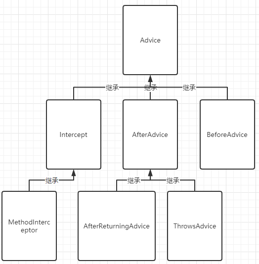
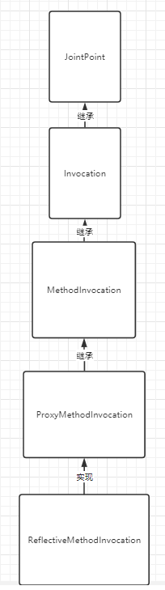

# SMPE后端框架-日志模块分享

分享人：张玉坤

日期：2021年1月30日

## 什么是 AOP

AOP （Aspect Orient Programming）,直译过来就是 面向切面编程。AOP 是一种编程思想，是面向对象编程（OOP）的一种补充。面向对象编程将程序抽象成各个层次的对象，而面向切面编程是将程序抽象成各个切面。
从《Spring实战（第4版）》图书中扒了一张图：


​	从该图可以很形象地看出，所谓切面，相当于应用对象间的横切点，我们可以将其单独抽象为单独的模块。

## 为什么需要 AOP

​	想象下面的场景，开发中在多个模块间有某段重复的代码，我们通常是怎么处理的？显然，没有人会靠“复制粘贴”吧。在传统的面向过程编程中，我们也会将这段代码，抽象成一个方法，然后在需要的地方分别调用这个方法，这样当这段代码需要修改时，我们只需要改变这个方法就可以了。然而需求总是变化的，有一天，新增了一个需求，需要再多出做修改，我们需要再抽象出一个方法，然后再在需要的地方分别调用这个方法，又或者我们不需要这个方法了，我们还是得删除掉每一处调用该方法的地方。实际上涉及到多个地方具有相同的修改的问题我们都可以通过 AOP 来解决。

## 1、日志使用

### 注解`@Log`接口切面日志使用

SMPE-ADMIN框架默认提供接口日志记录的注解`@Log`（在smpe-log子工程下实现）

```java
@Target(ElementType.METHOD)
@Retention(RetentionPolicy.RUNTIME)
public @interface Log {
    String value() default "";
}
```

**使用：**

controller层接口添加注解`@Log`，访问接口即可持久化到数据库进行缓存

**举例：**

```java
@Log("删除所有INFO日志")
@DeleteMapping(value = "/del/info")
@PreAuthorize("@smpe.check()")
public Result<Object> delAllInfoLog() {
    log.info(StrUtil.format("【查询日志数据 /api/logs/del/info】操作人userId：{}", SecurityUtils.getCurrentUserId()));
    logService.delAllByInfo();
    return Result.success();
}
```

**执行效果：**


**注意事项：**

- ==前台接口暂时不添加`@Log`==（持久化到数据库影响一定的mysql性能）
- 数据库记录接口参数信息暂时只记录添加`@RequestBody`或`@RequestParam`注解的参数
- 此注解主要记录增删改接口的日志

## 2、执行过程

1.Spring框架执行SpringMVC中的Controller层时，创建其代理对象，通过匹配该目标对象的方法是否符合切入点表达式logPointcut()定义的类型，则在不发生异常的情况下进入到自定义切面的logAround()方法当中。

```java
@Pointcut("@annotation(marchsoft.annotation.Log)")
public void logPointcut() {
    // 该方法无方法体,主要为了让同类中其他方法使用此切入点
}

@Around("logPointcut()")
public Object logAround(ProceedingJoinPoint joinPoint) throws Throwable {
    ……
        result = joinPoint.proceed();
    //继续执行@Log注解注释的方法
    SysLog sysLog = new SysLog();
    //设置sysLog对象的相关属性
    ……
        //调用service层的保存方法
        sysLogService.save(joinPoint, sysLog);
    //返回
    return result;
}
```

2.service层的save方法对传入的进行处理之后，调用dao层方法将sysLog对象保存至数据库

```java
public void save(ProceedingJoinPoint joinPoint, SysLog sysLog) {
    // 判断是否取消日志实例化
    if (ObjectUtils.isNotNull(sysLogConfig.isTest()) && !sysLogConfig.isTest()) {
        return;
    }
    MethodSignature signature = (MethodSignature) joinPoint.getSignature();
    Method method = signature.getMethod();
    Log aopLog = method.getAnnotation(Log.class);

    // 方法路径
    String methodName = joinPoint.getTarget().getClass().getName() + "." + signature.getName() + "()";

    // 描述
    if (sysLog != null) {
        sysLog.setDescription(aopLog.value());
    }

    //设置属性
    ……

    //调用mybatis-plus中的方法插入
    int count = sysLogMapper.insert(sysLog);
    if (count <= 0) {
        log.error(StrUtil.format("【接口切面日志保存失败】操作人id：{}", SecurityUtils.getCurrentUserId()));
    }
}
```

3.如果==`@Log`==类型注解注释的方法在执行的过程中发生异常，将会进入自定义切面的logAfterThrowing()方法中

```java
@AfterThrowing(pointcut = "logPointcut()", throwing = "e")
public void logAfterThrowing(JoinPoint joinPoint, Throwable e) {
    SysLog sysLog = new SysLog();
    //设置sysLog对象的相关属性
    //同理，调用service层的保存方法
    sysLogService.save((ProceedingJoinPoint) joinPoint, sysLog);
}
```

4.同第二步。


## 3、原理分析

### 3.1选择哪一种AOP声明样式

​	Spring框架中面向切面编程提供了三种实现： [schema-based approach](#aop-schema) （即XML类型）、@AspectJ（注解类型）、原生AOP

​	接下来主要讲述后两种实现。


​	@AspectJ方式是在Spring5当中被引入的，通过@AspectJ的支持，我们可以使用注解声明切面、切入点、增强。

```xml
<--AspectJ的maven地址-->
<dependency>
    <groupId>org.springframework</groupId>
    <artifactId>spring-aspects</artifactId>
    <version>5.2.5.RELEASE</version>
</dependency>
```

### 3.2基于@AspectJ的AOP

#### 3.2.1声明一个Aspect

开启@AspectJ注解支持之后，凡是使用@Aspect注解的类将会自动被Spring框架检测到，并且用于构造切面。

切面的注解使用方式：

```java
@Aspect
public class LogAspect {

}
```

​	切面能够拥有方法和属性，正如其他方法类一样。切面也可以有切入点（point），通知（advice)以及切入类型的声明（introduction  declarations）。

#### 3.2.2声明一个pointcut

​	切入点决定了插入哪一个连接点（即方法），并因此允许我们当通知方法运行时进行控制。一个切入点的声明包含两部分：一是名字和任意参数的签名，另一个是切入点表达式(pointcut expression)。

```java
@Pointcut("@annotation(marchsoft.annotation.Log)")// the pointcut expression
public void logPointcut() {}// the pointcut signature
```

支持的切入点指示符：


-   execution

-   within（限制pointcut匹配到的连接点必须在指定的包或者子包下）

    如：

    ```java
    //目标对象必须在指定的包路径下前置通知才会执行
    @Before("within(com.itheima.Test.target.Test)")
    public void beforeTest() {
        System.out.println("前置通知");
    }
    ```

-   @target（限制目标对象必须有指定类型的注解）

    如：

    ```java
    //目标对象具有@Transactional注解，后置通知才会执行
    @After("@target(org.springframework.transaction.annotation.Transactional)")
    public void afterTest() {
        System.out.println("后置通知");
    }
    @Transactional
    public class Test {
        @Log
        public void test() {
            System.out.println("Test中的方法");
        }
    }
    ```

-   @within（限制声明的目标对象必须有指定的注解，与@target功能类似）

-   @annotation

    如：

    ```java
    //目标对象中执行的方法具有@Log注解，环绕通知就会执行
    @Pointcut("@annotation(com.itheima.Test.Annotation.Log)")
    public void testPoint() {
    }
    //切入点表达式可以是对已经定义过的切入点的引用，也可以是引用在某个地方声明过的切入点表达式。
    @Around("testPoint()")
    public Object aroundTest(ProceedingJoinPoint proceedingJoinPoint) throws Throwable {
        System.out.println("绑定MethodInvocation会报错");
        Object proceed = proceedingJoinPoint.proceed();
        return proceed;
    }
    ```

-   ……

#### 3.2.3声明一个advice

​	通知与切入点表达式相关联，它与切入点配合用于完成对目标方法的增强，pointcut负责匹配目标对象的目标方法，advice主要负责通知。

##### 3.2.3.1Before advice

​	Before advice是使用@Before注解声明在一个切面当中。

```java
import org.aspectj.lang.annotation.Aspect;
import org.aspectj.lang.annotation.Before;

@Aspect
public class BeforeExample {

    @Before("testPoint()")
    public void doAccessCheck() {
        // ...
    }

}
```

##### 3.2.3.2After returning advice

​	After returning advice将会在匹配到的方法正常返回时执行，它使用@AfterReturning注解声明。

```java
import org.aspectj.lang.annotation.Aspect;
import org.aspectj.lang.annotation.AfterReturning;

@Aspect
public class AfterReturningExample {

    @AfterReturning("testPoint()")
    public void doAccessCheck() {
        // ...
    }

    //如果你需要进入advice体里面获取到真正的返回值，可以使用下列方式：
    @AfterReturning(
        pointcut="testPoint()",
        returning="retVal")
    public void doAccessCheck(Object retVal) {
        // ...
    }

}
```

##### 3.2.3.3After throwing advice

​	After throwing advice将会在匹配到的方法执行时抛出异常后执行，它使用@AfterThrowing注解声明。

```java
import org.aspectj.lang.annotation.Aspect;
import org.aspectj.lang.annotation.AfterThrowing;

@Aspect
public class AfterThrowingExample {

    @AfterThrowing("testPoint()")
    public void doRecoveryActions() {
        // ...
    }

    //如果你需要该类型的advice只在抛出给定异常的情况下运行时，亦或者进入advice内获取抛出的异常时，可以使用下列方式
    @AfterThrowing(
        pointcut="testPoint()",
        throwing="ex")
    public void doRecoveryActions(DataAccessException ex) {
        // ...
    }

}
```

##### 3.2.3.4After (finally) advice

​	After (finally) advice会在匹配到的方法执行完之后执行，它使用@After注解声明。After advice通常用于释放资源。

```java
import org.aspectj.lang.annotation.Aspect;
import org.aspectj.lang.annotation.After;

@Aspect
public class AfterFinallyExample {

    @After("testPoint()")
    public void doReleaseLock() {
        // ...
    }

}
```

##### 3.2.3.5Around advice

​	Around advice以“环绕”的方式运行于切入点表达式匹配到的正在执行的方法。环绕增既能在方法运行前执行也能在方法运行后执行。它也能够确定该方法何时、如何、甚至是否真正开始运行。如果线程安全的情况下你想要去获取方法执行之前或者之后的状态，你可以使用环绕通知。

​	Around advice是使用@Around注解声明的。Around advice当中的方法第一个参数必须是==ProceedingJoinPoint==类型的。在advice体内调用==ProceedingJoinPoint==对象的proceed()方法使后续的advice/目标方法继续执行。

```java
import org.aspectj.lang.annotation.Aspect;
import org.aspectj.lang.annotation.Around;
import org.aspectj.lang.ProceedingJoinPoint;

@Aspect
public class AroundExample {

    @Around("testPoint()")
    public Object doBasicProfiling(ProceedingJoinPoint pjp) throws Throwable {
        // start stopwatch
        Object retVal = pjp.proceed();
        // stop stopwatch
        return retVal;
    }

}
```

​	除了Spring框架除了支持使用@AspectJ还支持使用XML实现AOP，不过现在我们已经使用SpringBoot开发了，此处就不讲解XML方式。

##### 3.2.3.6获取当前的**JoinPoint**

​	任何被声明的advice方法，它的第一个参数可以声明一个==org.aspectj.lang.JoinPoint==类型的参数（Around Advice需要声明第一个参数为ProceedingJoinPoint类型的，其是JoinPoint类型的子接口）。JoinPoint提供了许多有用的方法：

-   getArgs()：返回方法的参数
-   getThis()：返回代理对象
-   getTarget()：返回目标对象
-   getSignature()：返回被增强方法的描述

如：

```java
@Before("testPoint()&&within(com.itheima.Test.target.Test)")
public void beforeTest(JoinPoint joinPoint) throws Exception {
    Signature signature = joinPoint.getSignature();
    Test newInstance = (Test) signature.getDeclaringType().getConstructor().newInstance();
    System.out.println("==============");
    newInstance.test();
    System.out.println("===============");
    System.out.println("前置通知");
}
```

##### 3.2.3.7Advice Ordering

​	如果多个advice都想在同一个连接点处运行的话会发生什么？ AspectJ能够决定advice的执行顺序，在多个advice执行的过程中拥有最高优先权的advice最先执行，拥有最低优先权的advice最后执行。

​	当定义在两个不同切面当中的advice作用于相同的切入点时，除非明确表示执行顺序，否则advice的执行顺序是未定义的。你可以控制advice的执行顺序明确其的优先级。可以实现==org.springframework.core.Ordered==接口或==@Order==注解在aspect类当中。上述的两个切面，如果其通过==@Order==方法返回的值越小，其中的advice具有更高的优先权。

### 3.3原生SpringAOP

​	接下来我们将讨论一下原生版本的SpringAOP的API，该版本的APO通常被用于Spring1.2的应用中。对于新开发的应用，推荐使用上述@AspectJ提供的AOP支持。但是，接下来描述的内容在Spring5中也是能够被全部支持的。

​	@AspectJ中的内容大多都是借助于原生SpringAOP来实现的。

==简化版AOP讲解==

#### 补充-代理模式

……

从ProxyFactoryBean一直讲到代理对象被创建出来。

#### 3.3.1Pointcut	

​	Spring框架中的==org.springframework.aop.Pointcut==接口是一个重要接口，能够用于对不同的类以及方法设置不同的advice，即对目标对象的方法通过相同的的Pointcut设置不同的Advice。

​	将该接口分为两部分：ClassFilter、MethodMatcher

```java
public interface Pointcut {
    ClassFilter getClassFilter();

    MethodMatcher getMethodMatcher();
}

//ClassFilter接口用于将切入点限制为给定的一组目标类（对类进行匹配）。
public interface ClassFilter {
    ClassFilter TRUE = TrueClassFilter.INSTANCE;

    //如果matches方法总是返回true，所有目标对象都将符合匹配
    boolean matches(Class<?> var1);
}

//MethodMatcher用于校验给定的目标类当中的方法是否符合切入点表达式（对方法进行匹配）
public interface MethodMatcher {
    MethodMatcher TRUE = TrueMethodMatcher.INSTANCE;
    
    boolean matches(Method var1, Class<?> var2);

    boolean isRuntime();

    boolean matches(Method var1, Class<?> var2, Object... var3);
}
```

​	注意：如果调用两个参数的matches方法判断时返回true,isRuntime()方法也返回true，那么每次连接点在执行之前都会再次调用三个参数的matches方法进行验证。——自定义AOP执行流程处会详细说明

​	==`boolean matches(Method var1, Class<?> var2)`==方法用于校验是否目标对象中给定的方法符合定义的切入点表达式。这个判断过程是在AOP代理被创建之后才执行的。

**常见的切入点实现类：**

1.  静态pointcuts

    ​	静态切入点作用于目标类的方法上，不能获取到执行方法的参数。静态切入点对于大多数应用场景来说是足够的了。

    常见的静态切入点：JdkRegexpMethodPointcut、RegexpMethodPointcutAdvisor、StaticMethodMatcherPointcut、AspectJExpressionPointcut等……

    ```java
//使用已定义的JdkRegexpMethodPointcut静态切入点类
    //创建Point对象
    AspectJExpressionTest aspectJExpressionTest = new AspectJExpressionTest();
    //设置匹配规则
    aspectJExpressionTest.setExpression("@within(org.springframework.transaction.annotation.Transactional)");
    
    //自定义静态切入点
    public class AspectJExpressionTest extends AspectJExpressionPointcut {
    
        //匹配规则
        public boolean matches(Method m, Class targetClass) {
            System.out.println("ssss");
            boolean flag = false;
            Annotation[] annotations = targetClass.getDeclaredAnnotations();
            for (Annotation annotation : annotations) {
                if (annotation instanceof Transactional) {
                    flag = true;
                }
            }
            return flag;
        }
    }
    ```
    
2.  动态pointcuts

    ​	由于动态切入点除了要考虑方法的名称等静态信息外，还要考虑方法的参数。由于它是动态的，在执行时既要计算方法的静态信息，还要计算其参数。因此，动态切入点要消耗更多的系统资源。

    ​	==注意：无论是动态切入点还是静态切入点，在目标对象的方法第一次被增强之前都会先执行一次；如果是动态切入点，那么在连接点执行之前还会再执行一次用于动态获取目标方法的信息==

    ​	动态连接点为什么会在目标方法执行之前再执行一次？——自定义AOP执行流程处会详细说明
    
    ​	常见的动态切入点：ControlFlowPointcut、DynamicMethodMatcherPointcut等……
    
    ```java
    //自定义动态切入点DynamicMethodMatcherPointcut
    public class DynamicPointcut extends DynamicMethodMatcherPointcut {
        //自定义切入点匹配规则：当目标方法具有自定义的@Log注解时切入点匹配成功
        public boolean matches(Method method, Class<?> aClass, Object... objects) {
            boolean flag = false;
            Annotation[] declaredAnnotations = method.getDeclaredAnnotations();
            for (Annotation annotation : declaredAnnotations) {
                if (Log.class == annotation.annotationType()) {
                    flag = true;
                }
            }
            System.out.println(flag);
            System.out.println(method.getName());
            System.out.println(aClass.getName());
            return flag;
        }
    }
    ```

#### 3.3.2Advice	

​	Spring框架提供几个常用的Advice，如：Before Advice、Throws Advice、Throws Advice、After Returning Advice等……但是你可以通过实现Advice类型的接口来扩展你想要的Advice。接下来将描述几个基本的Advice类型。

Advice继承图：



##### 3.3.2.1Intercept	

​	由上面在代理模式中讲到部分内容可知，在CGLIB动态代理的方式中，调用代理对象的目标方法时需要通过CGLIB包下的MethodInterceptor接口的实现类拦截之后进行增强。不同的通知方式可以通过实现不同的Advice接口来实现。

​	在Spring中最基本的Advice之一是*interception around advice*。它的一个子接口**MethodInterceptor**，即方法拦截器,用于Spring AOP编程中的动态代理，使用该接口的实现类用于实现“环绕”增强的功能。

```java
public interface MethodInterceptor extends Interceptor {
    //通知内容
    Object invoke(MethodInvocation invocation) throws Throwable;
}
```

​	MethodInvocation参数当中封装着目标对象的方法、参数，目标连接点，AOP代理对象，以及拦截器链等信息。invoke()方法应该返回调用的结果：即连接点的返回值。

```java
public Object invoke(MethodInvocation methodInvocation) throws Throwable {
    System.out.println("Before: invocation=[" + invocation + "]");
    Object rval = invocation.proceed();
    System.out.println("Invocation returned");
    return rval;
}
```

​	但调用MethodInvocation的proceed()方法之后，就会==沿着拦截器链向连接点前进==。

具体体现：我们点进invocation.proceed()当中可以发现

```java
public class ReflectiveMethodInvocation implements ProxyMethodInvocation, Cloneable {
    
    @Nullable
    public Object proceed() throws Throwable {
        if (this.currentInterceptorIndex == this.interceptorsAndDynamicMethodMatchers.size() - 1) {
            return this.invokeJoinpoint();
        } else {
            Object interceptorOrInterceptionAdvice = this.interceptorsAndDynamicMethodMatchers.get(++this.currentInterceptorIndex);
            if (interceptorOrInterceptionAdvice instanceof InterceptorAndDynamicMethodMatcher) {
                InterceptorAndDynamicMethodMatcher dm = (InterceptorAndDynamicMethodMatcher)interceptorOrInterceptionAdvice;
                return dm.methodMatcher.matches(this.method, this.targetClass, this.arguments) ? dm.interceptor.invoke(this) : this.proceed();
            } else {
                //暂且不考虑其他地方，就此处的MethodInterceptor是不是感觉很熟悉？
                //通过MethodInterceptor接口，我们可以自定义环绕通知
                //所以由此可以得出，所有的拦截器都是在此处执行的
                return ((MethodInterceptor)interceptorOrInterceptionAdvice).invoke(this);
                /**
                *由invoke(this)即下方的类图可以得知，MethodInvocation的实现类ReflectiveMethodInvocation被当作参数在多个通知之间传递
                */
            }
        }
    }
}
```

ReflectiveMethodInvocation的实现关系如下：



###### 补充-责任链模式

​	责任链模式（Chain of Responsibility Pattern）==为请求创建了一个接收者对象的链==。这种模式给予请求的类型，对请求的发送者和接收者进行解耦。

​	在这种模式中，通常每个接收者都包含对另一个接收者的引用。如果一个对象不能处理该请求，那么它会把相同的请求传给下一个接收者，依此类推（与递归有些相似，只不过递归是对自身程序的调用，责任链则是对其中包含的接收者的依次调用）。

**主要解决：**职责链上的处理者负责处理请求，客户只需要将请求发送到职责链上即可，无须关心请求的处理细节和请求的传递，所以职责链将请求的发送者和请求的处理者解耦了。

**如何解决：**拦截的类都实现统一接口。

**优点：** 

​	1、降低耦合度。它将请求的发送者和接收者解耦。

​	 2、简化了对象。使得对象不需要知道链的结构。 

​	3、增强给对象指派职责的灵活性。通过改变链内的成员或者调动它们的次序，允许动态地新增或者删除责任。 

​	4、增加新的请求处理类很方便。

**使用场景：**

​	 1、有多个对象可以处理同一个请求，具体哪个对象处理该请求由运行时刻自动确定。 

​	2、在不明确指定接收者的情况下，向多个对象中的一个提交一个请求。 

​	3、可动态指定一组对象处理请求。

**实现：**

​	一个小Demo，模拟AOP责任链。

​		==ReflectiveMethodInvocation==中封装着那么多的信息，同时随着拦截器链向下逐层传递。那么这个对象的作用给是什么呢？

​	在此处我们做一个有意思的实验：如果在环绕停止中不执行==methodInvocation.proceed()==会发生什么情况？

```java
//自定义环绕通知
public class MethodInterceptTest implements MethodInterceptor {
    public Object invoke(MethodInvocation methodInvocation) throws Throwable {
        Method method = methodInvocation.getMethod();
        System.out.println("环绕前1："+method.getName());
        //        Object proceed = methodInvocation.proceed();
        System.out.println("环绕后1");
        return null;
    }
}

//为目标对象中符合匹配规则的方法设置拦截器
public static void testInterceptChain() {
    ProxyFactoryBean proxyFactoryBean = buildProxyFactoryBean();
    //拦截器1
    MethodInterceptTest interceptTest = new MethodInterceptTest();
    //为目标对象添加拦截器链
    proxyFactoryBean.addAdvice(interceptTest);
    //获取代理对象并执行方法
    proxyMethodRun(proxyFactoryBean);
}
//执行结果：
    环绕前1：test
    环绕后1

//恢复methodInvocation.proceed()的结果：
    环绕前1：test
    Test中的方法
    环绕后1
```

​	发现：只有执行==methodInvocation.proceed()==方法，目标对象中的方法才会执行。

​	总结：拦截器链（即通知组成的链）会依次传递，直到==this.currentInterceptorIndex == this.interceptorsAndDynamicMethodMatchers.size() - 1==，即所有的通知执行完。通知执行完之后，将会执行连接点（目标对象的方法），连接点的返回值会经过拦截器链依次向上传递。

##### 3.3.2.1Before Advice

​	这个类型的Advice会在方法执行之前调用。

```java
public interface MethodBeforeAdvice extends BeforeAdvice {
    void before(Method m, Object[] args, Object target) throws Throwable;
}
```

​	注意：这个方法的返回值是null，Before Advice能够在连接点运行之前进行插入执行，但是它不能改变连接点方法的返回值。如果Before Advice执行时就抛出了异常，它将会影响拦截器链的继续向下执行。

​	事实上，前置通知的功能实现是借助于环绕通知。——自定义AOP执行流程处详解

```java
//该类实现了MethodInterceptor接口，具有环绕通知的功能
public class MethodBeforeAdviceInterceptor implements MethodInterceptor, Serializable {
    //通过Before Advice实现前置通知
    private MethodBeforeAdvice advice;

    public MethodBeforeAdviceInterceptor(MethodBeforeAdvice advice) {
        Assert.notNull(advice, "Advice must not be null");
        this.advice = advice;
    }

    public Object invoke(MethodInvocation mi) throws Throwable {
        //前置通知就是在环绕通知的基础上只进行前置通知，然后对拦截器链放行，让其继续向下执行，直至最后执行到目标对象的方法
        this.advice.before(mi.getMethod(), mi.getArguments(), mi.getThis());
        //拦截器链放行，执行下一个通知/目标对象的方法
        return mi.proceed();
    }
}
```

##### 3.3.2.3Throws Advice

​	如果连接点抛出异常，Throws Advice会在连接点被返回之后调用。该接口内部不提供任何方法，它是一个标记接口，标识给定对象实现一个或多个类型化方法。具体形式如下：

```java
public interface ThrowsAdvice extends AfterAdvice {
}
//ThrowsAdvice接口并没有定义抽象方法，但是可以自定义下列类型的方法
afterThrowing([Method, args, target], subclassOfThrowable)
```

例如：如果一个RemoteException类型的异常被抛出，该Advice将会被执行

```java
public class RemoteThrowsAdvice implements ThrowsAdvice {
    public void afterThrowing(RemoteException ex) throws Throwable {
        // Do something with remote exception
    }
}
```

​	同理，异常通知功能的实现也是借助于环绕通知。——自定义AOP执行流程处详解

```java
public class ThrowsAdviceInterceptor implements MethodInterceptor, AfterAdvice {
    private final Object throwsAdvice;

    public Object invoke(MethodInvocation mi) throws Throwable {
        try {
            //拦截器链放行，执行下一个通知/目标对象的方法
            return mi.proceed();
        } catch (Throwable var4) {
            //出现异常进行捕获
            Method handlerMethod = this.getExceptionHandler(var4);
            if (handlerMethod != null) {
                this.invokeHandlerMethod(mi, var4, handlerMethod);
            }
            throw var4;
        }
    }
}
```

##### 3.3.2.4After Returning Advice

​	After Returning Advice即后置通知。该Advice能够获取到目标对象方法的返回值，参数等信息。

```java
public interface AfterReturningAdvice extends AfterAdvice {
    void afterReturning(@Nullable Object var1, Method var2, Object[] var3, @Nullable Object var4) throws Throwable;
}
```

​	同理，异常通知功能的实现也是借助于环绕通知。——自定义AOP执行流程处详解

```java
public class AfterReturningAdviceInterceptor implements MethodInterceptor, AfterAdvice, Serializable {
    private final AfterReturningAdvice advice;

    public Object invoke(MethodInvocation mi) throws Throwable {
        //拦截器链放行，执行下一个通知/目标对象的方法
        Object retVal = mi.proceed();
        //当拦截器链执行完目标对象的方法并向上返回时，将会执行后置通知
        this.advice.afterReturning(retVal, mi.getMethod(), mi.getArguments(), mi.getThis());
        return retVal;
    }
}
```

###### 补充-适配器模式

**意图：**将一个类的接口转换成客户希望的另外一个接口。适配器模式使得原本由于接口不兼容而不能一起工作的那些类可以一起工作。

**主要解决：**主要解决在软件系统中，常常要将一些"现存的对象"放到新的环境中，而新环境要求的接口是现对象不能满足的。

**优点：** 

​	1、可以让任何两个没有关联的类一起运行。

​	 2、提高了类的复用。 

​	3、增加了类的透明度。 

​	4、灵活性好。

**实现：**

​	一个小Demo，将Advice与责任链中的调用者结合起来一起工作。

**自定义Advice链：**

```java
public static void testMultiAdvice() {
    //获取proxy代理工厂
    ProxyFactoryBean proxyFactoryBean = buildProxyFactoryBean();
    //前置通知
    BeforeAdviceTest advice = new BeforeAdviceTest();
    //环绕通知1
    MethodInterceptTest interceptTest = new MethodInterceptTest();
    //环绕通知2
    MethodInterceptTest2 interceptTest2 = new MethodInterceptTest2();
    //后置通知
    AfterAdviceTest afterAdviceTest = new AfterAdviceTest();
    //为目标对象添加Advice链
    proxyFactoryBean.addAdvice(interceptTest);
    proxyFactoryBean.addAdvice(interceptTest2);
    proxyFactoryBean.addAdvice(afterAdviceTest);
    proxyFactoryBean.addAdvice(advice);    
    //获取代理对象并执行方法
    proxyMethodRun(proxyFactoryBean);
}
//添加Advice顺序为：环绕Advice1、环绕Advice2、后置Advice、前置Advice
执行结果：
    环绕前1：test
    环绕前2：test
    前置通知
    Test中的方法
    后置通知
    环绕后2
    环绕后1
```


​	前置通知和后置通知并不会因为添加的顺序不同而导致执行顺序不同，因为它们肯定会在拦截器链执行前或者执行后再执行相应的通知。

#### 3.3.3Advisor

​	在Spring框架中一个Advisor就是一个切面，它包含一个Advice和相关联的Pointcut表达式。


==`org.springframework.aop.support.DefaultPointcutAdvisor`==是最常用的Advisor类，例如它能够与`MethodInterceptor`, `BeforeAdvice` or `ThrowsAdvice`等类型的Advice一同使用用于构建增强。

例如：

```java
//创建Point对象
JdkRegexpMethodPointcut jdkRegexpMethodPointcut = new JdkRegexpMethodPointcut();
//设置匹配规则
jdkRegexpMethodPointcut.setPattern(".*test.*");
//创建Advisor对象
DefaultPointcutAdvisor defaultPointcutAdvisor = new DefaultPointcutAdvisor(jdkRegexpMethodPointcut, methodIntercept);
```

注意：Advisor有两个构造函数，其中一个是需要Advisor和Pointcut，另一个是只需要Advice的。

**分析：**

```java
public class DefaultPointcutAdvisor extends AbstractGenericPointcutAdvisor implements Serializable {
    
    public DefaultPointcutAdvisor(Advice advice) {
        this(Pointcut.TRUE, advice);
    }

    public DefaultPointcutAdvisor(Pointcut pointcut, Advice advice) {
        this.pointcut = Pointcut.TRUE;
        this.pointcut = pointcut;
        this.setAdvice(advice);
    }
}

//通过Pointcut.TRUE可以得到
class TruePointcut implements Pointcut, Serializable {
    private TruePointcut() {
    }

    public ClassFilter getClassFilter() {
        return ClassFilter.TRUE;
    }

    public MethodMatcher getMethodMatcher() {
        return MethodMatcher.TRUE;
    }
}
//该TruePointcut类型的切入点表达式无论在进行类校验还是方法校验时都会返回true
//通过MethodMatcher.TRUE获得
class TrueMethodMatcher implements MethodMatcher, Serializable {
     private TrueMethodMatcher() {
    }
    public boolean matches(Method method, @Nullable Class<?> targetClass) {
        return true;
    }
}
//通过ClassFilter.TRUE获得
class TrueClassFilter implements ClassFilter, Serializable {
     private TrueClassFilter() {
    }

    public boolean matches(Class<?> clazz) {
        return true;
    }
}
```

​	由此可知，当使用Advisor却没有设置Pointcut时，Spring框架底层会帮我们创建一个TruePointcut对象，该对象对于任何方法和类的校验都会返回true。相当于该advisor中的pointcut在校验目标对象时总是返回true，advice总是被执行。

3.5使用工厂模式创建AOP代理


在Spring框架中有三种方式可以创建AOP代理：ProxyFactory、 ProxyFactoryBean、AspectJProxyFactory

#### 3.3.4ProxyFactoryBean

​	在Spring框架当中，创建AOP代理的最好方式就是通过==`*org.springframework.aop.framework.ProxyFactoryBean*`==。它给予了将要被引用的pointcuts和advice，以及它们执行顺序完整的控制。

​	使用ProxyFactoryBean或其他支持IoC的类来创建AOP代理的一个最重要的好处是，这意味着通知和切入点也可以由IoC管理。这是一个强大的特性，支持某些很难用其他AOP框架实现的方法。

控制Advisor的次序：

```java
public static void testMultiAdvice() {
    ProxyFactoryBean proxyFactoryBean = buildProxyFactoryBean();
    //前置通知
    BeforeAdviceTest advice = new BeforeAdviceTest();
    //环绕通知1
    MethodInterceptTest interceptTest = new MethodInterceptTest();
    //环绕通知2
    MethodInterceptTest2 interceptTest2 = new MethodInterceptTest2();
    //后置通知
    AfterAdviceTest afterAdviceTest = new AfterAdviceTest();
    //为目标对象添加Advice链
    proxyFactoryBean.addAdvice(interceptTest);
    proxyFactoryBean.addAdvice(interceptTest2);
    proxyFactoryBean.addAdvice(afterAdviceTest);
    proxyFactoryBean.addAdvice(advice);
    //获取代理对象并执行方法
    proxyMethodRun(proxyFactoryBean);
}
运行结果：
    环绕前1：test
    环绕前2：test
    前置通知
    Test中的方法
    后置通知
    环绕后2
    环绕后1
```

​	如果将要被代理的目标是接口类型，ProxyFactoryBean选择使用JDK动态代理；如果目标对象没有实现任何接口，则通常使用CGLIB代理。

==注意：真正创建AOP代理对象的是AopProxyFactory接口的实现类，ProxyFactoryBean等几个类只负责封装创建代理对象所需要的信息。==

​	具体创建过程会在自定义AOP执行流程处分析。

##### 3.3.4.1使用ProxyFactory创建AOP代理

​	ProxyFactory允许我们创建SpringAOP而不需要依赖于SpringIOC。

##### 3.3.4.2使用AspectJProxyFactory创建AOP代理

​	==`org.springframework.aop.aspectj.annotation.AspectJProxyFactory`==能够使用@AspectJ配置的切面中的一个或多个Advice来创建目标对象的代理对象。

```java
//创建一个能够产生给定目标对象的代理对象的工厂
AspectJProxyFactory factory = new AspectJProxyFactory(targetObject);

//添加一个切面，这个切面必须被@AspectJ注解
//如果你需要配置多个切面，该方法可以调用多次
factory.addAspect(AspectTest.class);
```

例如：

```java
//自定义一个注解
@Target(ElementType.METHOD)
@Retention(RetentionPolicy.RUNTIME)
public @interface Log {
    String value() default "";
}
//自定义一个切面
@Aspect
public class AspectTest {

    @Pointcut("@annotation(com.itheima.Test.Annotation.Log)")
    public void testPoint(){};

    @After("testPoint()")
    public void afterTest(){
        System.out.println("后置通知");
    }

}

public class AspectJProxyFactoryTest {
    public static void main(String[] args) {
        Test test = new Test();
        AspectJProxyFactory jProxyFactory = new AspectJProxyFactory(test);

        //设置切面类
        jProxyFactory.addAspect(AspectTest.class);
        jProxyFactory.addAspect(AspectTest.class);

        //获取代理对象
        Test proxy = jProxyFactory.getProxy();
        proxy.test();
    }
}
执行结果：
    Test中的方法
    后置通知
    后置通知
```

​	分析源码得知：AspectJProxyFactory在添加切面时会将@Aspect注解的类转换为Advisor添加至AdvisedSupport中供AspectJProxyFactory使用。


## 4、自定义AOP执行流程

以ProxyFactoryBean实现对Test类的前置通知为例，代理流程图：

4.1创建ProxyFactoryBean及目标对象

```java
public static ProxyFactoryBean buildProxyFactoryBean() {
    //创建目标对象（被代理对象）
    Test test = new Test();
    //创建Proxy代理工厂
    ProxyFactoryBean proxyFactoryBean = new ProxyFactoryBean();
    //设置目标对象
    proxyFactoryBean.setTarget(test);

    return proxyFactoryBean;
}
```

4.2创建MethodBeforeAdvice的实现类用于实现前置通知

```java
public class BeforeAdviceTest implements MethodBeforeAdvice {
    public void before(Method method, Object[] objects, Object o) throws Throwable {
        System.out.println("前置通知");        
    }
}
```

4.3为目标对象添加前置通知

```java
public static void testBeforeAdvice() {
    ProxyFactoryBean proxyFactoryBean = buildProxyFactoryBean();
    //前置通知
    BeforeAdviceTest advice = new BeforeAdviceTest();
    //为目标对象添加前置通知
    proxyFactoryBean.addAdvice(advice);
    //获取代理对象并执行方法
    proxyMethodRun(proxyFactoryBean);
}
```

4.3.1addAdvice方法分析

​	前置通知advice被最终添加到了哪里？最终又在哪里起作用？亦或者中间有没有进行什么“包装”？让我们跟随着addAdvice方法一起深入了解！

```java
public class AdvisedSupport extends ProxyConfig implements Advised {
    private List<Advisor> advisors;
    private void addAdvisorInternal(int pos, Advisor advisor) throws AopConfigException {       
        if (this.isFrozen()) {
            ……
        } else {
            //由之前的类图我们得知，ProxyFactoryBean是继承自AdvisedSupport
            //最终，我们添加的advisor被加入到了AdvisedSupport对象的advisors集合中
            //此时，第一个问题得到了解决
            this.advisors.add(pos, advisor);
            ……
        }
    }
}
```

4.4运行

```java
public static void proxyMethodRun(ProxyFactoryBean proxyFactoryBean) {
    Test proxyFactoryBeanObject = (Test) proxyFactoryBean.getObject();
    proxyFactoryBeanObject.test();
}
```

4.4.1getObject方法分析

​	getObject()方法最终是在哪里获得的代理对象？

```java
//ProxyFactoryBean对象
public class ProxyFactoryBean extends ProxyCreatorSupport implements FactoryBean<Object>, BeanClassLoaderAware, BeanFactoryAware {
    //实例化代理对象
    private synchronized Object newPrototypeInstance() {
        //创建了ProxyCreatorSupport对象
        ProxyCreatorSupport copy = new ProxyCreatorSupport(this.getAopProxyFactory());
        //将ProxyFactoryBean对象属性复制给ProxyCreatorSupport
        //注意：自定义的advice已经被复制到ProxyCreatorSupport对象中
        copy.copyConfigurationFrom(this, targetSource, this.freshAdvisorChain());
        //调用ProxyCreatorSupport的方法创建aop代理
        return this.getProxy(copy.createAopProxy());
    }
}

//ProxyCreatorSupport对象
public class ProxyCreatorSupport extends AdvisedSupport {
    public ProxyCreatorSupport() {
        this.aopProxyFactory = new DefaultAopProxyFactory();
    }
    //创建aop代理
    protected final synchronized AopProxy createAopProxy() {
        ……       
            return this.getAopProxyFactory().createAopProxy(this);
    }
}

//通过源码分析，最终是由DefaultAopProxyFactory根据ProxyCreatorSupport（复制了ProxyFactoryBean对象的属性，同时也是AdvisedSupport的子类）对象的属性选择代理方式，并创建AopProxy对象
public class DefaultAopProxyFactory implements AopProxyFactory, Serializable {
    public DefaultAopProxyFactory() {
    }

    //该方法通过判断AdvisedSupport中所包含的信息来选择是使用JDK还是Cglib
    public AopProxy createAopProxy(AdvisedSupport config) throws AopConfigException {
        //如果代理对象不是普通类就选择jdk
        if (!config.isOptimize() && !config.isProxyTargetClass() && !this.hasNoUserSuppliedProxyInterfaces(config)) {
            return new JdkDynamicAopProxy(config);
        } else {
            Class<?> targetClass = config.getTargetClass();
            if (targetClass == null) {
                throw new AopConfigException("TargetSource cannot determine target class: Either an interface or a target is required for proxy creation.");
            } else {
                //目标类不是接口类型并且是普通类，则选择cglib代理方式，反之jdk
                return (AopProxy)(!targetClass.isInterface() && !Proxy.isProxyClass(targetClass) ? new ObjenesisCglibAopProxy(config) : new JdkDynamicAopProxy(config));
            }
        }
    }
}

class CglibAopProxy implements AopProxy, Serializable {
    public CglibAopProxy(AdvisedSupport config) throws AopConfigException {
        ……
        //在ProxyFactoryBean中封装的advisor最终在CglibAopProxy对象中起作用
        this.advised = config;  
    }
}

//最终获取的对象是通过CglibAopProxy对象调用getProxy方法返回的
//getProxy方法中会对返回的对象设置一个Callback类型的对象，该对象是通过调用getCallbacks()方法获得的，在getCallbacks()方法中又调用了一个内部类DynamicAdvisedInterceptor
```

4.5BeforeAdvice之-我变成了谁？

​	之前提到过，在拦截器链执行时都是通过MethodInterceptor接口类型的对象调用invoke方法执行的，BeforeAdvice肯定是在被调用之前转换为了MethodInterceptor类型。

​	具体是在哪里？

```java
private static class DynamicAdvisedInterceptor implements MethodInterceptor, Serializable {
    private final AdvisedSupport advised;

    //获取ProxyFactoryBean对象中封装的信息：如自定义的前置advice
    public DynamicAdvisedInterceptor(AdvisedSupport advised) {
        this.advised = advised;
    }

    @Nullable
    public Object intercept(Object proxy, Method method, Object[] args, MethodProxy methodProxy) throws Throwable {
        //通过ProxyFactoryBean对象的方法获取用于目标方法的拦截器链
        List<Object> chain = this.advised.getInterceptorsAndDynamicInterceptionAdvice(method, targetClass);
        //分析：由之前的责任链模式的demo类比得知，CglibMethodInvocation是拦截器链的执行者，负责执行拦截器链中的拦截器。那么拦截器链肯定在该对象创建之前就已经得到了。
        retVal = (new CglibAopProxy.CglibMethodInvocation(proxy, target, method, args, targetClass, chain, methodProxy)).proceed();
    }
}
```

```java
//AdvisedSupport对象
public class AdvisedSupport extends ProxyConfig implements Advised {
    AdvisorChainFactory advisorChainFactory;

    public AdvisedSupport() {
        ……
            this.advisorChainFactory = new DefaultAdvisorChainFactory();
        ……
    }

    public List<Object> getInterceptorsAndDynamicInterceptionAdvice(Method method, @Nullable Class<?> targetClass) {
        //通过内部类来缓存那些用于增强已经执行过的方法的拦截器链
        AdvisedSupport.MethodCacheKey cacheKey = new AdvisedSupport.MethodCacheKey(method);
        List<Object> cached = (List)this.methodCache.get(cacheKey);
        //如果该目标方法是第一次执行，则组装用于该方法的拦截器链
        if (cached == null) {
            cached = this.advisorChainFactory.getInterceptorsAndDynamicInterceptionAdvice(this, method, targetClass);
            this.methodCache.put(cacheKey, cached);
        }

        return cached;
    }
}

//DefaultAdvisorChainFactory
public class DefaultAdvisorChainFactory implements AdvisorChainFactory, Serializable {
    public DefaultAdvisorChainFactory() {
    }

    public List<Object> getInterceptorsAndDynamicInterceptionAdvice(Advised config, Method method, @Nullable Class<?> targetClass) {
        ……
        //调用静态方法获取AdvisorAdapterRegistry对象（核心接口）
        AdvisorAdapterRegistry registry = GlobalAdvisorAdapterRegistry.getInstance();
        //获取ProxyFactoryBean对象中添加的advisor(pointcut+advice)
        Advisor[] var8 = config.getAdvisors();
        //遍历advisor
        for(int var10 = 0; var10 < var9; ++var10) {
            Advisor advisor = var8[var10];
            MethodInterceptor[] interceptors;
            //如果该advisor不是引入类型的Advisor
            if (advisor instanceof PointcutAdvisor) {
                //将其转为PointcutAdvisor
                PointcutAdvisor pointcutAdvisor = (PointcutAdvisor)advisor;
                //判断目标类是否符合切入点表达式
                if (config.isPreFiltered() || pointcutAdvisor.getPointcut().getClassFilter().matches(actualClass)) {
                    //重点：调用核心接口组装advisor
                    interceptors = registry.getInterceptors(advisor);
                    //获取pointcut中的MethodMatcher
                    MethodMatcher mm = pointcutAdvisor.getPointcut().getMethodMatcher();
                    //判断目标方法是否符合切入点表达式
                    //此处印证了3.3.1Pointcut API处提出的结论
                    if (MethodMatchers.matches(mm, method, actualClass, hasIntroductions)) {
                        //如果MethodMatcher的isRuntime()为true，则表明该pointcut是动态pointcut
                        if (mm.isRuntime()) {
                            MethodInterceptor[] var15 = interceptors;
                            int var16 = interceptors.length;

                            for(int var17 = 0; var17 < var16; ++var17) {
                                MethodInterceptor interceptor = var15[var17];
                                //获取到核心接口封装之后返回的MethodInterceptor并与MethodInterceptor再次组装
                                //该对象需要在目标方法执行之前再利用动态pointcut匹配目标方法
                                interceptorList.add(new InterceptorAndDynamicMethodMatcher(interceptor, mm));
                            }
                        } else {
                            //如果MethodMatcher的isRuntime()为false
                            //直接获取核心接口封装之后返回的MethodInterceptor
                            interceptorList.addAll(Arrays.asList(interceptors));
                        }
                    }
                }
            //如果该advisor是引入类型的advisor
            } else if (advisor instanceof IntroductionAdvisor) {
               ……
            } else {
                Interceptor[] interceptors = registry.getInterceptors(advisor);
                interceptorList.addAll(Arrays.asList(interceptors));
            }
        }

        return interceptorList;
    }
}
```

​	注意：此处根据MethodInterceptor对象的isRuntime()方法返回true/false来选择是否对MethodInterceptor进行再次封装，InterceptorAndDynamicMethodMatcher对象与MethodInterceptor对象在真正执行时是不同的。前者会再次调用MethodMatcher对连接点进行校验之后选择增强，而否则直接进行增强。

```java
//核心接口AdvisorAdapterRegistry的实现类DefaultAdvisorAdapterRegistry
public class DefaultAdvisorAdapterRegistry implements AdvisorAdapterRegistry, Serializable {
    private final List<AdvisorAdapter> adapters = new ArrayList(3);

    public DefaultAdvisorAdapterRegistry() {
        //重点
        this.registerAdvisorAdapter(new MethodBeforeAdviceAdapter());
        this.registerAdvisorAdapter(new AfterReturningAdviceAdapter());
        this.registerAdvisorAdapter(new ThrowsAdviceAdapter());
    }

    public MethodInterceptor[] getInterceptors(Advisor advisor) throws UnknownAdviceTypeException {
        List<MethodInterceptor> interceptors = new ArrayList(3);
        //获取在ProxyFactoryBean添加的自定义BeforeAdviceTest（MethodBeforeAdvice的实现类）
        Advice advice = advisor.getAdvice();
        //判断其是否是MethodInterceptor类型
        if (advice instanceof MethodInterceptor) {
            interceptors.add((MethodInterceptor)advice);
        }

        Iterator var4 = this.adapters.iterator();

        while(var4.hasNext()) {
            AdvisorAdapter adapter = (AdvisorAdapter)var4.next();
            //重点：遍历AdvisorAdapter集合，判断哪个支持该类型的advice
            if (adapter.supportsAdvice(advice)) {
                interceptors.add(adapter.getInterceptor(advisor));
            }
        }

        if (interceptors.isEmpty()) {
            throw new UnknownAdviceTypeException(advisor.getAdvice());
        } else {
            return (MethodInterceptor[])interceptors.toArray(new MethodInterceptor[interceptors.size()]);
        }
    }
}

//此处以MethodBeforeAdviceAdapter对象为例
class MethodBeforeAdviceAdapter implements AdvisorAdapter, Serializable {
    MethodBeforeAdviceAdapter() {
    }

    public boolean supportsAdvice(Advice advice) {
        //判断通知是否是前置通知类型
        return advice instanceof MethodBeforeAdvice;
    }

    public MethodInterceptor getInterceptor(Advisor advisor) {
        //将advice转换为前置通知类型
        MethodBeforeAdvice advice = (MethodBeforeAdvice)advisor.getAdvice();
        //将前置通知封装进方法拦截器
        return new MethodBeforeAdviceInterceptor(advice);
    }
}

//印证了补充-责任链模式处的结论
//印证了3.3.4Before Advice处的结论
//前置通知方法拦截器
public class MethodBeforeAdviceInterceptor implements MethodInterceptor, Serializable {
    private MethodBeforeAdvice advice;

    public MethodBeforeAdviceInterceptor(MethodBeforeAdvice advice) {
        Assert.notNull(advice, "Advice must not be null");
        this.advice = advice;
    }

    public Object invoke(MethodInvocation mi) throws Throwable {
        //执行前置通知
        this.advice.before(mi.getMethod(), mi.getArguments(), mi.getThis());
        //拦截器链继续向下执行
        return mi.proceed();
    }
}
```

​	总结：无论是前置通知，亦或者是后置通知、异常通知、环绕通知，最终都是以方法拦截器（MethodInterceptor）的形式“串成一条链”，采用责任链模式被执行者”由外到里“依次调用，链的末端是目标方法，目标方法执行完之后，沿着该链”由里向外“依次执行，最终达到对目标方法的增强效果。

​	拦截器链组装好之后，需要一个执行者进行调用。

```java
//组装好的拦截器链
List<Object> chain = this.advised.getInterceptorsAndDynamicInterceptionAdvice(method, targetClass);
Object retVal;
if (chain.isEmpty() && Modifier.isPublic(method.getModifiers())) {
    ……
} else {
    //创建执行者，并执行拦截器链
    retVal = (new CglibAopProxy.CglibMethodInvocation(proxy, target, method, args, targetClass, chain, methodProxy)).proceed();
}

//执行者
public class ReflectiveMethodInvocation implements ProxyMethodInvocation, Cloneable {
    private int currentInterceptorIndex = -1;
    
    @Nullable
    public Object proceed() throws Throwable {
        //判断拦截链是否执行完
        if (this.currentInterceptorIndex == this.interceptorsAndDynamicMethodMatchers.size() - 1) {
            //执行完就执行连接点
            return this.invokeJoinpoint();
        } else {
            //获取到下一个要执行的拦截点
            Object interceptorOrInterceptionAdvice = this.interceptorsAndDynamicMethodMatchers.get(++this.currentInterceptorIndex);
            //如果下一个拦截点是InterceptorAndDynamicMethodMatcher类型（即包含动态pointcut）
            if (interceptorOrInterceptionAdvice instanceof InterceptorAndDynamicMethodMatcher) {
                //类型转换
                InterceptorAndDynamicMethodMatcher dm = (InterceptorAndDynamicMethodMatcher)interceptorOrInterceptionAdvice;
                //调用动态pointcut匹配目标类的目标方法；匹配成功进行增强，反之执行下一个拦截点
                //印证3.3.1Pointcut API处的两个结论
                return dm.methodMatcher.matches(this.method, this.targetClass, this.arguments) ? dm.interceptor.invoke(this) : this.proceed();
            } else {
                //如果下一个拦截点不包含动态pointcut，则直接进行增强
                return ((MethodInterceptor)interceptorOrInterceptionAdvice).invoke(this);
            }
        }
    }
}
```


## 5、框架流程分析

​	Spring AOP是以动态代理为基础的，代理过程中要么使用JDK动态代理（基于反射），要么使用CGLIB代理（利用字节码）去创建目标对象的代理对象。此处的目标对象是指使用==`@Log`==标识的方法所在对象。


### 5.1框架中环绕通知详解

通知方法与两点有关：

1.  切入点表达式（匹配对谁进行通知）
2.  Advice相对于对于==切入点表达式所匹配到的连接点==的执行顺序（在连接点之前执行，还是之后执行，亦或者是环绕执行。这取决于Advice的添加顺序）

切入点表达式可以是对已经定义过的切入点的引用，也可以是引用在某个地方声明过的切入点表达式。此处使用的是第一种方式。

```java
@Around("logPointcut()")
public Object logAround(ProceedingJoinPoint joinPoint) throws Throwable {
    Object result;  
    result = joinPoint.proceed();//方法继续执行
    return result;
}
```

例如：通过环绕通知可以获取到方法执行前后的时间差

```java
@Around("logPointcut()")
public Object logAround(ProceedingJoinPoint joinPoint) throws Throwable {
    Object result;
    currentTime = new ThreadLocal<>();
    currentTime.set(Instant.now().toEpochMilli());//方法执行之前的时刻    
    result = joinPoint.proceed();//方法继续执行
    //获取方法执行之后的时刻，并求出请求的耗时
    sysLog.setRequestTime(Instant.now().toEpochMilli() - currentTime.get());
}
```

注意事项：

-   环绕增强通过@Around注解声明

-   增强的方法中第一个参数必须是ProceedingJoinPoint类型的

    

==ProceedingJoinPoint.proceed()作用效果与MethodInvocation.proceed()效果相同==。此处使用的是原型模式中的浅克隆。

通过原型模式复制了一份MethodInvocation的实现类（ReflectiveMethodInvocation），并调用实现类的proceed()方法沿着拦截器链继续向下执行。

```java
//ProceedingJoinPoint实现类
public class MethodInvocationProceedingJoinPoint implements ProceedingJoinPoint, StaticPart {
    private final ProxyMethodInvocation methodInvocation;

    public Object proceed() throws Throwable {
        //克隆ReflectiveMethodInvocation并调用克隆对象的proceed()方法
        return this.methodInvocation.invocableClone().proceed();
    }
}

//ProxyMethodInvocation的实现类
public class ReflectiveMethodInvocation implements ProxyMethodInvocation, Cloneable {
    public MethodInvocation invocableClone() {
        Object[] cloneArguments = this.arguments;
        if (this.arguments.length > 0) {
            cloneArguments = new Object[this.arguments.length];
            System.arraycopy(this.arguments, 0, cloneArguments, 0, this.arguments.length);
        }

        return this.invocableClone(cloneArguments);
    }

    public MethodInvocation invocableClone(Object... arguments) {
        if (this.userAttributes == null) {
            this.userAttributes = new HashMap();
        }

        try {
            ReflectiveMethodInvocation clone = (ReflectiveMethodInvocation)this.clone();
            clone.arguments = arguments;
            return clone;
        } catch (CloneNotSupportedException var3) {
            throw new IllegalStateException("Should be able to clone object of type [" + this.getClass() + "]: " + var3);
        }
    }
}
```

### 5.2流程分析

1、CglibAopProxy类中的内部类DynamicAdvisedInterceptor

```java
class CglibAopProxy implements AopProxy, Serializable {
    private final AdvisedSupport advised;
    ……
        //开启代理时，CglibAopProxy会调用内部类DynamicAdvisedInterceptor的intercept方法拦截目标对象的方法
        private static class DynamicAdvisedInterceptor implements MethodInterceptor, Serializable {
            //调用该方法对方法进行拦截
            @Nullable
            public Object intercept(Object proxy, Method method, Object[] args, MethodProxy methodProxy) throws Throwable {
                Object var16;
                target = targetSource.getTarget();
                ……
                //通过该方法从Proxy配置对象当中获取到拦截链
                List<Object> chain = this.advised.getInterceptorsAndDynamicInterceptionAdvice(method, targetClass);
                Object retVal;
                if (chain.isEmpty() && Modifier.isPublic(method.getModifiers())) {
                    ……
                } else {
                    //创建CglibMethodInvocation对象，并调用proceed()方法
                    retVal = (new CglibAopProxy.CglibMethodInvocation(proxy, target, method, args, targetClass, chain, methodProxy)).proceed();
                }

            }
        }
```


2.ReflectiveMethodInvocation

```java
//CglibMethodInvocation类本身并没有proceed()方法，使用的是父类ReflectiveMethodInvocation当中的proceed()方法
public class ReflectiveMethodInvocation implements ProxyMethodInvocation, Cloneable {
	protected final List<?> interceptorsAndDynamicMethodMatchers;
    ……        
        @Nullable
        /**
        *依次执行拦截器链当中的拦截器
        */        
        public Object proceed() throws Throwable {
        if (this.currentInterceptorIndex == this.interceptorsAndDynamicMethodMatchers.size() - 1) {
            return this.invokeJoinpoint();
        } else {            
            if (interceptorOrInterceptionAdvice instanceof InterceptorAndDynamicMethodMatcher) {
               ……           
                //判断当前执行方法是否符合methodMatcher当中声明的expression表达式，如果匹配将获取其MethodInterceptor对象进行增强
                return dm.methodMatcher.matches(this.method, targetClass, this.arguments) ? dm.interceptor.invoke(this) : this.proceed();
            } else {
                //如果不是InterceptorAndDynamicMethodMatcher类型，强转为MethodInterceptor进行增强
                return ((MethodInterceptor)interceptorOrInterceptionAdvice).invoke(this);
            }
        }
    }
}    

```


3、MethodSecurityInterceptor

```java
public class MethodSecurityInterceptor extends AbstractSecurityInterceptor implements MethodInterceptor {
    ……
        //对方法进行增强
        public Object invoke(MethodInvocation mi) throws Throwable {
        //前置增强
        InterceptorStatusToken token = super.beforeInvocation(mi);

        Object result;
        try {
            //方法继续执行
            result = mi.proceed();
        } finally {
            //异常增强
            super.finallyInvocation(token);
        }
		//后置增强
        return super.afterInvocation(token, result);
    }        
}
```

